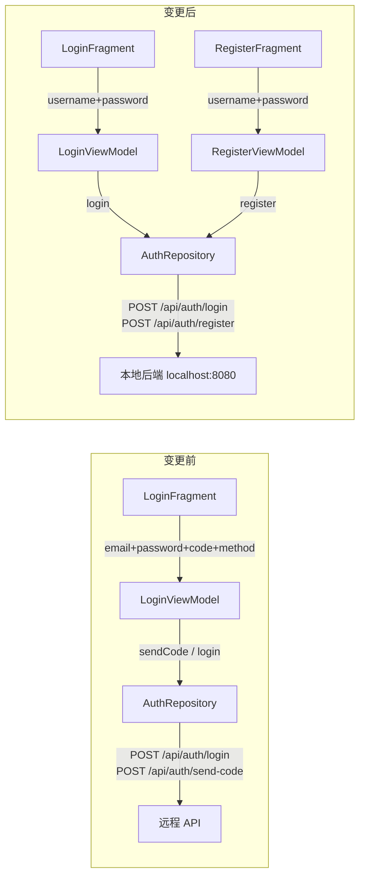

# 设计文档 — 本地认证简化

## 概述

本设计文档描述将 WiseCloud MDM Android 客户端的认证流程从复杂的邮箱 + 密码 + 验证码（邮件/MFA）模式简化为用户名 + 密码模式的技术方案，并新增用户注册功能。

核心变更：
- API 基础地址从 `https://api.wisecloud.com/` 切换到 `http://localhost:8080/`
- 登录请求模型从 `{email, password, verifyCode, verifyMethod}` 简化为 `{username, password}`
- 新增注册请求模型 `{username, password}`
- 登录界面移除验证码/MFA 区域，改为用户名 + 密码
- 新增注册页面（RegisterFragment）及对应导航
- 移除 `sendVerificationCode`、`VerifyMethod`、倒计时等旧逻辑

技术栈不变：Kotlin + Retrofit + Hilt + Jetpack Navigation + MVVM

## 架构

### 变更前后对比



### 导航流程

```mermaid
graph TD
    Login[LoginFragment<br/>用户名+密码] -->|登录成功| Dashboard[DashboardFragment]
    Login -->|点击"去注册"| Register[RegisterFragment<br/>用户名+密码+确认密码]
    Register -->|注册成功/点击"返回登录"| Login
```

### 分层架构（仅认证模块变更部分）

```
UI Layer:
  LoginFragment (简化) → LoginViewModel (简化)
  RegisterFragment (新增) → RegisterViewModel (新增)

Data Layer:
  AuthRepository (简化 login, 新增 register, 移除 sendCode)
  MdmApiService (简化 login 签名, 新增 register, 移除 sendVerificationCode)
  RequestModels (简化 LoginRequest, 新增 RegisterRequest, 移除 SendCodeRequest)

DI Layer:
  NetworkModule (BASE_URL → http://localhost:8080/)
```

设计决策：
1. 保持现有 MVVM + Repository 分层不变，仅修改认证相关组件
2. RegisterViewModel 独立于 LoginViewModel，职责单一
3. InputValidator 新增 `isValidUsername` 方法，复用密码校验逻辑

## 组件与接口

### NetworkModule 变更

```kotlin
// 变更前
private const val BASE_URL = "https://api.wisecloud.com/"

// 变更后
private const val BASE_URL = "http://localhost:8080/"
```

### RequestModels 变更

```kotlin
// 变更后的 LoginRequest（移除 verifyCode, verifyMethod）
data class LoginRequest(
    val username: String,
    val password: String
)

// 新增 RegisterRequest（仅 username + password，无 email）
data class RegisterRequest(
    val username: String,
    val password: String
)

// 移除 SendCodeRequest
```

### MdmApiService 变更

```kotlin
interface MdmApiService {
    // 简化登录接口签名
    @POST("api/auth/login")
    suspend fun login(@Body request: LoginRequest): ApiResponse<LoginResponse>

    // 新增注册接口
    @POST("api/auth/register")
    suspend fun register(@Body request: RegisterRequest): ApiResponse<Unit>

    // 移除 sendVerificationCode
    // 其余接口不变
}
```

### AuthRepository 变更

```kotlin
interface AuthRepository {
    // 简化：仅 username + password
    suspend fun login(username: String, password: String): Result<LoginResponse>
    // 新增
    suspend fun register(username: String, password: String): Result<Unit>
    // 保留
    fun logout()
    // 移除 sendCode
}
```

### LoginViewModel 变更

```kotlin
// 移除 VerifyMethod 枚举
// 移除 countdownSeconds LiveData
// 移除 verifyMethod LiveData
// 移除 sendVerificationCode() 方法
// 移除 switchVerifyMethod() 方法
// 移除 startCountdown() 方法

// login() 简化为：
fun login(username: String, password: String) {
    if (!InputValidator.isValidUsername(username)) { ... }
    if (!InputValidator.isValidPassword(password)) { ... }
    // 直接调用 authRepository.login(username, password)
}

// saveCredentials / loadSavedCredentials 改用 username 替代 email
```

### RegisterViewModel（新增）

```kotlin
@HiltViewModel
class RegisterViewModel @Inject constructor(
    private val authRepository: AuthRepository
) : ViewModel() {

    val registerState: LiveData<RegisterUiState>

    fun register(username: String, password: String, confirmPassword: String) {
        // 1. 校验 username 非空
        // 2. 校验 password 长度 >= 8
        // 3. 校验 password == confirmPassword
        // 4. 调用 authRepository.register(username, password)
    }
}

sealed class RegisterUiState {
    object Idle : RegisterUiState()
    object Loading : RegisterUiState()
    object Success : RegisterUiState()
    data class Error(val message: String) : RegisterUiState()
    object NetworkError : RegisterUiState()
}
```

### InputValidator 变更

```kotlin
object InputValidator {
    // 新增：用户名校验（非空、非纯空白）
    fun isValidUsername(username: String): Boolean = username.trim().isNotEmpty()

    // 保留：密码校验
    fun isValidPassword(password: String): Boolean = password.length >= 8

    // 移除或保留（不影响功能）：isValidEmail, isValidMfaCode, isValidVerificationCode
}
```

### 导航图变更

```xml
<!-- 新增 RegisterFragment 目的地 -->
<fragment
    android:id="@+id/registerFragment"
    android:name="com.wisecloud.app.ui.auth.RegisterFragment"
    android:label="Register"
    tools:layout="@layout/fragment_register">
    <action
        android:id="@+id/action_registerFragment_to_loginFragment"
        app:destination="@id/loginFragment"
        app:popUpTo="@id/loginFragment"
        app:popUpToInclusive="true" />
</fragment>

<!-- LoginFragment 新增导航到注册页的 action -->
<action
    android:id="@+id/action_loginFragment_to_registerFragment"
    app:destination="@id/registerFragment" />
```

### UI 布局变更

**fragment_login.xml**：
- 将 `tilEmail` / `etEmail` 改为 `tilUsername` / `etUsername`（用户名输入）
- 移除 `layoutEmailVerify`（验证码区域）
- 移除 `layoutMfa`（MFA 区域）
- 移除 `btnSwitchMethod`（切换验证方式按钮）
- 新增 `btnGoRegister`（"去注册"文字按钮）

**fragment_register.xml**（新增）：
- 用户名输入框
- 密码输入框
- 确认密码输入框
- 注册按钮
- "返回登录"文字按钮
- 加载指示器

### TokenManager 变更

```kotlin
// saveCredentials / getSavedCredentials 改用 username 替代 email
fun saveCredentials(username: String, password: String)
fun getSavedCredentials(): Pair<String, String>?  // (username, password)
```

## 数据模型

### 请求模型

| 模型 | 字段 | 类型 | 说明 |
|------|------|------|------|
| LoginRequest | username | String | 用户名 |
| LoginRequest | password | String | 密码 |
| RegisterRequest | username | String | 用户名 |
| RegisterRequest | password | String | 密码 |

### 响应模型（不变）

| 模型 | 字段 | 类型 | 说明 |
|------|------|------|------|
| LoginResponse | token | String | JWT Token |
| LoginResponse | expiresIn | Long | 过期时间（秒） |
| LoginResponse | username | String | 用户名（可选） |
| ApiResponse\<Unit\> | code | Int | 状态码（注册成功=200） |
| ApiResponse\<Unit\> | message | String | 提示信息 |

### UI 状态模型

```kotlin
// LoginUiState（简化，移除 MFA 相关）
sealed class LoginUiState {
    object Idle : LoginUiState()
    object Loading : LoginUiState()
    data class Success(val token: String) : LoginUiState()
    data class Error(val message: String) : LoginUiState()
    object NetworkError : LoginUiState()
}

// RegisterUiState（新增）
sealed class RegisterUiState {
    object Idle : RegisterUiState()
    object Loading : RegisterUiState()
    object Success : RegisterUiState()
    data class Error(val message: String) : RegisterUiState()
    object NetworkError : RegisterUiState()
}
```


## 正确性属性（Correctness Properties）

*正确性属性是指在系统所有合法执行路径中都应成立的特征或行为——本质上是对系统行为的形式化陈述。属性是连接人类可读规格说明与机器可验证正确性保证之间的桥梁。*

### Property 1: LoginResponse 序列化往返一致性

*For any* 有效的 token 字符串和 expiresIn 长整型值，将 LoginResponse 序列化为 JSON 再反序列化回 LoginResponse，得到的 token 和 expiresIn 字段应与原始值完全一致。

**Validates: Requirements 2.3**

### Property 2: 登录成功后 Token 持久化

*For any* 有效的 LoginResponse（包含非空 token），当 AuthRepository.login 返回 Success 时，TokenManager 中存储的 token 应与 LoginResponse 中的 token 完全一致。

**Validates: Requirements 2.4**

### Property 3: 登录请求字段透传

*For any* 用户名字符串和密码字符串，LoginViewModel.login 发起的请求应包含与输入完全一致的 username 和 password 字段，不包含 verifyCode 或 verifyMethod 字段。

**Validates: Requirements 3.5, 6.6**

### Property 4: 错误信息透传显示

*For any* 后端返回的错误信息字符串，LoginViewModel 的 loginState 应转换为 Error 状态，且 Error.message 与后端返回的 message 完全一致。

**Validates: Requirements 3.8**

### Property 5: 密码不一致时客户端拒绝注册

*For any* 两个不相等的字符串作为 password 和 confirmPassword，RegisterViewModel.register 应将状态设为 Error 且不发起网络请求。

**Validates: Requirements 4.5**

### Property 6: 合法输入触发注册请求

*For any* 非空非纯空白的用户名、长度 ≥ 8 的密码、且 password == confirmPassword，RegisterViewModel.register 应发起包含该 username 和 password 的注册 API 调用。

**Validates: Requirements 4.6**

## 错误处理

### 登录错误处理

| 场景 | HTTP 状态码 | 客户端行为 |
|------|-----------|-----------|
| 用户名或密码错误 | 401 | 显示 "用户名或密码错误" Snackbar |
| 请求参数缺失 | 400 | 显示后端返回的 message |
| 网络连接失败 | N/A | 显示 "网络连接失败，请检查网络设置" Snackbar |
| 服务器内部错误 | 500 | 显示 "服务器内部错误" Snackbar |

### 注册错误处理

| 场景 | HTTP 状态码 | 客户端行为 |
|------|-----------|-----------|
| 用户名已存在 | 409 | 显示 "用户名已存在" Snackbar |
| 密码长度不足 | 400 | 显示 "密码长度不足" Snackbar |
| 密码与确认密码不一致 | N/A（客户端校验） | 显示 "两次密码输入不一致" 错误提示 |
| 用户名为空 | N/A（客户端校验） | 显示 "请输入用户名" 错误提示 |
| 网络连接失败 | N/A | 显示 "网络连接失败，请检查网络设置" Snackbar |

### 错误处理复用

登录和注册共用 `BaseRepository.safeApiCall` 的异常捕获机制：
- `UnknownHostException` / `SocketTimeoutException` → `Result.NetworkError`
- `HttpException` → `Result.Error(code, message)`
- 其他异常 → `Result.Error(-1, message)`

## 测试策略

### 属性测试（Property-Based Tests）

使用 Kotest 的 property testing 模块（`kotest-property`），最少 100 次迭代，验证上述 6 个正确性属性：

- 每个属性测试必须引用设计文档中的属性编号
- 标签格式：`Feature: local-auth-simplification, Property {N}: {property_text}`
- 属性测试库：`io.kotest:kotest-property-jvm`
- 断言库：`io.kotest:kotest-assertions-core-jvm`

重点属性：
- LoginResponse 序列化往返（Property 1）
- Token 持久化（Property 2）
- 登录请求字段透传（Property 3）
- 密码不一致拒绝（Property 5）
- 合法输入触发注册（Property 6）

### 单元测试（Unit Tests）

使用 JUnit 5 + MockK：

- LoginViewModel：验证简化后的 login 方法正确调用 AuthRepository
- RegisterViewModel：验证注册流程各状态转换（Idle → Loading → Success/Error）
- AuthRepository：验证 login/register 方法正确调用 MdmApiService 并处理响应
- InputValidator：验证 isValidUsername 和 isValidPassword 的边界情况

### UI 测试（Espresso）

- LoginFragment：验证用户名/密码输入框、登录按钮存在；验证验证码/MFA 区域已移除
- RegisterFragment：验证注册表单元素存在；验证导航到登录页
- 导航测试：验证登录→注册、注册→登录的导航流程

### 测试覆盖目标

| 层级 | 覆盖率目标 | 重点 |
|-----|----------|-----|
| ViewModel | ≥ 80% | 状态转换、输入校验 |
| Repository | ≥ 80% | API 调用、Token 管理 |
| 属性测试 | 6 个属性 × 100 次 | 核心逻辑正确性 |
| UI 测试 | 关键页面 | 元素存在性、导航 |
